# InSo Bootstrap CLI

> **NOTE:** The Cognite Strategic Customer Services (SCS) team provides the inso-bootstrap CLI as-is. It is not an officially supported Cognite CLI with product-grade SLOs.

Use the **inso-bootstrap CLI** to configure and bootstrap a new Cognite Data Fusion (CDF) project with CDF groups, datasets, and RAW databases. You can use the CLI to separate data by different levels or groupings of data. For example, you can separate data by data sources, use cases, user input, location, site, etc.

The CLI restricts the structure of the datasets and the groups it supports, and you may or may not be able to use the CLI to maintain existing CDF projects.

## Table of Content

<!-- @import "[TOC]" {cmd="toc" depthFrom=1 depthTo=6 orderedList=false} -->

<!-- code_chunk_output -->

- [InSo Bootstrap CLI](#inso-bootstrap-cli)
  - [Table of Content](#table-of-content)
  - [Install](#install)
    - [Configure and test](#configure-and-test)
    - [Authenticate](#authenticate)
    - [Running locally](#running-locally)
    - [GitHub Actions](#github-actions)
    - [Azure setup](#azure-setup)
  - [Bootstrap CLI concepts](#bootstrap-cli-concepts)
    - [Secure access management](#secure-access-management)
    - [Datasets](#datasets)
  - [Bootstrap CLI makes access-control and data lineage manageable](#bootstrap-cli-makes-access-control-and-data-lineage-manageable)
    - [Namespaces](#namespaces)
    - [Templating](#templating)
    - [Packaging](#packaging)
    - [Bootstrap CLI example](#bootstrap-cli-example)
      - [Groups](#groups)
      - [Scopes](#scopes)
  - [Bootstrap CLI commands](#bootstrap-cli-commands)
    - [`Prepare` command](#prepare-command)
    - [`Deploy` command](#deploy-command)
    - [`Delete` command](#delete-command)
    - [`Diagram` command](#diagram-command)
  - [Configuration](#configuration)
    - [Configuration for all commands](#configuration-for-all-commands)
      - [Environment variables](#environment-variables)
    - [Configuration for the `deploy` command](#configuration-for-the-deploy-command)
      - [`features` section](#features-section)
      - [`idp-cdf-mappings` section: IdP Group to CDF Group mapping](#idp-cdf-mappings-section-idp-group-to-cdf-group-mapping)
        - [`namespaces` section](#namespaces-section)
    - [Configuration for the `delete` command](#configuration-for-the-delete-command)
        - [`delete_or_deprecate` section](#delete_or_deprecate-section)
- [Common practices & How-Tos](#common-practices--how-tos)
  - [How to implement Read-only Shared Access](#how-to-implement-read-only-shared-access)
- [Development / Contribute](#development--contribute)
  - [Inspiration](#inspiration)
  - [Semantic versioning](#semantic-versioning)
- [Other ways of running](#other-ways-of-running)
  - [Run locally with Poetry](#run-locally-with-poetry)
  - [Run locally with Python](#run-locally-with-python)
  - [Run locally with Docker](#run-locally-with-docker)

<!-- /code_chunk_output -->

## Install

We recommend installing the inso-bootstrap CLI with Poetry on Linux, Windows Subsystem for Linux version 2 (WSL2), or macOS.

For other installation methods or native Windows use, see [How to run](#how-to-run).

1. Follow the steps in the [Poetry installation guide](https://python-poetry.org/docs/#installation) to install Poetry.

2. Install and set up the local Python environment:

   ```
   poetry build
   poetry install
   poetry update
   ```

### Configure and test

Before running the CLI, you need to set up your configuration file. The example configuration file, `config/config-deploy-example-v2.yml`, has extensive comments explaining the syntax with examples for all the important features. You can also find more information in the [Configuration](#configuration) section.

The CLI has four main commands:

- `diagram` - documents the current configuration as a Mermaid diagram.
- `prepare` - prepares an elevated CDF group, `cdf:bootstrap`, and links it to an IdP group.
- `deploy ` - deploys bootstrap components from a configuration file.
- `delete` - deletes CDF groups, datasets, and RAW databases

To test the configuration without connecting to a CDF project, comment out the `cognite` section of the configuration file and run the `diagram` command (on WSL):

```
 poetry run bootstrap-cli diagram --cdf-project=shiny-dev configs/config-deploy-example-v2.yml | clip.exe
```

On Mac/Linux:

```
 poetry run bootstrap-cli diagram --cdf-project=shiny-dev configs/config-deploy-example-v2.yml > diagram.txt
```

Then navigate to [Mermaid Live](https://mermaid.live/) and paste the content of the clipboard/file to see a diagram of the groups, datasets, and RAW databases the tool will create.

### Authenticate

The easiest way to set up authentication is to copy the `.env_example` file to `.env` and add the necessary environment variables. For information about the variables, see the [Environment variables](#environment-variables) section.

When you have set up the `.env` file, you can check that the tool can connect to CDF by uncommenting the `cognite` section of the configuration file and re-running the `diagram` command above.

### Running locally

Run the `prepare` command to create a group with the necessary access rights for the bootstrap-cli. The command creates a CDF group and links it to the IdP group the application is registered in.

**NOTE**: You can run all commands in dry-run mode by specifying `--dry-run=yes` before the command. Running in dry-run mode logs the intended API actions.

```
poetry run bootstrap-cli prepare --idp-source-id <idp-source-id>
```

For more information, see [Prepare command](#prepare-command).

When you have run the `prepare` command, the CLI has the necessary access rights to run the `deploy` command.

```
poetry run bootstrap-cli deploy --cdf-project=shiny-dev configs/config-deploy-example-v2.yml
```

This creates the groups, datasets, and RAW databases as defined in your configuration file and illustrated in the diagram you created above.

If any of the groups, datasets, or RAW databases already exist, the CLI updates/recreates them.

### GitHub Actions

Below is an example GitHub Actions workflow:

```yaml
name: actions
on:
  push:
    branches:
      - main
jobs:
  cdf-bootstrap:
    name: Deploy Bootstrap Pipeline
    environment: dev
    runs-on: ubuntu-latest
    # Environment variables
    env:
      CDF_PROJECT: yourcdfproject
      CDF_CLUSTER: yourcdfcluster
      IDP_TENANT: your-idf-client-id
      CDF_HOST: https://yourcdfcluster.cognitedata.com/
    steps:
      # Checkout repository
      - name: Checkout
        uses: actions/checkout@v3
        with:
          submodules: false
      # Bootstrap_cli
      - name: bootstrap
        # use a tagged release like @v2.0.0
        # uses: cognitedata/inso-bootstrap-cli@v2.0.0
        # or use the latest release available using @main
        uses: cognitedata/inso-bootstrap-cli@v2.0.1
        env:
          BOOTSTRAP_IDP_CLIENT_ID: ${{ secrets.CLIENT_ID }}
          BOOTSTRAP_IDP_CLIENT_SECRET: ${{ secrets.CLIENT_SECRET }}
          BOOTSTRAP_CDF_HOST: ${{ env.CDF_HOST }}
          BOOTSTRAP_CDF_PROJECT: ${{ env.CDF_PROJECT }}
          BOOTSTRAP_IDP_TOKEN_URL: https://login.microsoftonline.com/${{ env.IDP_TENANT }}/oauth2/v2.0/token
          BOOTSTRAP_IDP_SCOPES: ${{ env.CDF_HOST }}.default
        # additional parameters for running the action
        with:
          config_file: ./config/config-deploy-example-v2.yml
```

### Azure setup

To use Azure Active Directory (Azure AD) as the IdP, you must first register the CLI as an app in Azure AD.

1. Create an app registration in Azure AD. Make sure that the application is a member of the Azure AD group assigned as `oidc-admin-group`.
2. Create a secret for the app registration and add it to the BOOTSTRAP_IDP_CLIENT_SECRET .env variable.
3. Use the Azure AD application ID in the BOOTSTRAP_IDP_CLIENT_ID .env variable

## Bootstrap CLI concepts

The Bootstrap CLI tackles both DAY1 and DAY2 activities related to access management:

- Groups
- Scopes
  - Datasets
  - RAW databases

**DAY1** activities relates to the initial setup and configuration before the system can be used.

The **DAY2** activities cover scaling and operating the system.

Cognite provides support for a list of **DAY1** activities to enable governance best practices from the start, such as:

- **Secure access management** to control access for users, apps and services to the various types of resources (datasets, assets, files, events, time series, etc.) in CDF.
- **Datasets** to document and track data lineage.
- **Data quality** to monitor the data integration pipelines into CDF.

These areas are interconnected and span the customers' identity provider (Azure AD) and CDF. The CLI uses the CDF API and a configuration-driven approach for the CDF areas.

### Secure access management

**Secure access management** requires IdP groups (most often Azure AD groups) to be linked to CDF groups. Authenticating users and apps is handled by the customer's IdP and authorization is handled by CDF groups. CDF groups are defined by capabilities and actions (for example, a "time series" capability with "read/write" actions).

**Secure access management** configuration:

- Link CDF groups and IdP groups.
- IdP owner responsibilities:
  - Create IdP group(s).
  - Create service principals (users and apps) and map them to IdP groups

### Datasets

CDF **datasets** scope CDF groups' capabilities to a set of CDF resources. This allows you to fence future usage and stay within your scope. Creating new datasets is a governance action to be executed by a defined process. An exception is CDF Raw data which is scoped through CDF RAW databases.

CDF **scopes** configuration:

- CDF datasets
- CDF RAW databases

## Bootstrap CLI makes access-control and data lineage manageable

CDF groups allow you to create very complex configurations from many different capabilities (~30), actions (2-5), and scopes (x). To establish **manageable** and **understandable** access control and data lineage, the `bootstrap-cli` uses templating and packaging to reduce the complexity. In addition, it uses namespaces to add operational semantics (meaning).

### Namespaces

A two-layered hierarchy allows you to organize a growing list of CDF groups.

The first layer of the hierarchy is a namespace and the second layer is individual elements within a namespace. For example, you can have the following namespaces with explanations:

- **src**: to scope 3rd party sources.
- **fac**: to scope customer facilities by name.
- **ca**: to scope "corporate applications" (SAP, Salesforce, ...).
- **uc**: to scope your use-cases ("UC:001 - Flow Optimization", "UC:002 - Trading Balances".
- **in**: to scope user input from UIs.

A namespace allows each project to apply the operational semantic that fits the project and the customer's terminology.

The above is an example of namespaces, and you can modify the namespaces to fit your project.

Best practice is to keep the names short and add long names and details to the `description` fields.

### Templating

1. CDF groups are created in `OWNER` and `READ` pairs.
   - **All** capabilities are handled the same and are applied:
     - as an `OWNER` set.
     - OR as a `READ`-only set
   - Access control only works through scopes. Within your scopes, you can work without limits.
2. The CDF groups can be called "strict-scoped", meaning that access control to the group only allows reading and writing data to the available scopes.
   - No data can exist outside the predefined scopes.
   - No user or app can create additional scopes.

### Packaging

1. Every `OWNER/READ` pair of CDF groups is configured with the same package of scopes:
   - Two RAW DBs (one for staging, one for state-stores).
   - One dataset (for all CDF resource types, as capabilities are not restricted)
   - **Only** `OWNER` groups can be configured with additional shared access to scopes of other CDF groups.
     - see also: ["How to implement read-only shared-access groups"](#how-to-implement-read-only-shared-access)
   - This allows users (or apps) working on a Use-Case (`uc`):
     1. To read data from scopes of other source (`src`) groups, and
     2. To write the processed and value-added data to its own scope,
     3. Allowing data lineage from sources through use-case model to data products.

### Bootstrap CLI example

Below is an extract from the example config `config-deploy-example-v2.yml` which uses the main features of the CLI.
(The suffix `-v2` indicates that the configuration is based using the latest v2 release syntax.)

```yaml
bootstrap:
  features:
    aggregated-level-name: all
    dataset-suffix: ds
    rawdb-suffix: db
  idp-cdf-mappings:
    - cdf-project: shiny-dev
      - cdf-group: cdf:all:owner
          idp-source-id: acd2fe35-aa51-45a7-acef-11111111111
          idp-source-name: CDF_DEV_ALLPROJECTS_OWNER
      - cdf-group: .....
        ...
  namespaces:
    - ns-name: src
      description: Customer source-systems
      ns-nodes:
        - node-name: src:001:sap
          description: Sources 001; from SAP
          external-id: src:001:sap
        - node-name: src:002:weather
          description: Sources 002; from Weather.com
          # external-id will be auto generated in this case

    - ns-name: in
      description: End user data-input provided through deployed CDF driven solutions
      ns-nodes:
        - node-name: in:001:trade
          description: Description about user inputs related to name
          # external_id: in:001:trade

    - ns-name: uc
      description: Use Cases representing the data-products
      ns-nodes:
        - node-name: uc:001:demand
          description: Use Case 001; Demand Side
          metadata:
            created: 220427
            generated: by cdf-config-hub script
          shared-access:
            read:
              - node-name: src:001:sap
              - node-name: src:002:weather
            owner:
              - node-name: in:001:trade
```

Using the diagram functionality of the CLI, we can produce the following chart of the example config `config-deploy-example-v2.yml`. The dashed lines show `read`-access, and the solid ones `write`.

```mermaid
graph LR
%% 2022-05-16 14:08:18 - Script generated Mermaid diagram

subgraph "idp" ["IdP Groups for CDF: 'shiny-dev'"]
  %% IdP objectId: 314159-aa51-45a7-acef-11111111111
CDF_DEV_UC001DEMAND_READ[\"CDF_DEV_UC001DEMAND_READ"/]
  %% IdP objectId: acd2fe35-aa51-45a7-acef-11111111111
CDF_DEV_ALL_READ[\"CDF_DEV_ALL_READ"/]
  %% IdP objectId: acd2fe35-aa51-45a7-acef-11111111111
CDF_DEV_ALL_OWNER[\"CDF_DEV_ALL_OWNER"/]
end


subgraph "owner" ["'Owner' Groups"]

subgraph "core_cdf_owner" ["Node Level (Owner)"]
  cdf:src:001:sap:owner("cdf:src:001:sap:owner")
  cdf:src:002:weather:owner("cdf:src:002:weather:owner")
  cdf:in:001:trade:owner("cdf:in:001:trade:owner")
  cdf:uc:001:demand:owner("cdf:uc:001:demand:owner")
end


subgraph "ns_cdf_owner" ["Namespace Level (Owner)"]
  cdf:src:all:owner["cdf:src:all:owner"]
  cdf:in:all:owner["cdf:in:all:owner"]
  cdf:uc:all:owner["cdf:uc:all:owner"]
  cdf:all:owner["cdf:all:owner"]
end


subgraph "scope_owner" ["Scopes (Owner)"]
  src:001:sap:db__owner__raw[["src:001:sap:db"]]
  src:001:sap:db:state__owner__raw[["src:001:sap:db:state"]]
  src:001:sap:ds__owner__datasets>"src:001:sap:ds"]
  src:002:weather:db__owner__raw[["src:002:weather:db"]]
  src:002:weather:db:state__owner__raw[["src:002:weather:db:state"]]
  src:002:weather:ds__owner__datasets>"src:002:weather:ds"]
  src:all:db__owner__raw[["src:all:db"]]
  src:all:db:state__owner__raw[["src:all:db:state"]]
  src:all:ds__owner__datasets>"src:all:ds"]
  in:001:trade:db__owner__raw[["in:001:trade:db"]]
  in:001:trade:db:state__owner__raw[["in:001:trade:db:state"]]
  in:001:trade:ds__owner__datasets>"in:001:trade:ds"]
  in:all:db__owner__raw[["in:all:db"]]
  in:all:db:state__owner__raw[["in:all:db:state"]]
  in:all:ds__owner__datasets>"in:all:ds"]
  uc:001:demand:db__owner__raw[["uc:001:demand:db"]]
  uc:001:demand:db:state__owner__raw[["uc:001:demand:db:state"]]
  in:001:trade:db__owner__raw[["in:001:trade:db"]]
  in:001:trade:db:state__owner__raw[["in:001:trade:db:state"]]
  uc:001:demand:ds__owner__datasets>"uc:001:demand:ds"]
  in:001:trade:ds__owner__datasets>"in:001:trade:ds"]
  src:001:sap:db__owner__raw[["src:001:sap:db"]]
  src:001:sap:db:state__owner__raw[["src:001:sap:db:state"]]
  src:002:weather:db__owner__raw[["src:002:weather:db"]]
  src:002:weather:db:state__owner__raw[["src:002:weather:db:state"]]
  src:001:sap:ds__owner__datasets>"src:001:sap:ds"]
  src:002:weather:ds__owner__datasets>"src:002:weather:ds"]
  uc:all:db__owner__raw[["uc:all:db"]]
  uc:all:db:state__owner__raw[["uc:all:db:state"]]
  uc:all:ds__owner__datasets>"uc:all:ds"]
  all:db__owner__raw[["all:db"]]
  all:db:state__owner__raw[["all:db:state"]]
  all:ds__owner__datasets>"all:ds"]
end

end


subgraph "read" ["'Read' Groups"]

subgraph "core_cdf_read" ["Node Level (Read)"]
  cdf:src:001:sap:read("cdf:src:001:sap:read")
  cdf:src:002:weather:read("cdf:src:002:weather:read")
  cdf:in:001:trade:read("cdf:in:001:trade:read")
  cdf:uc:001:demand:read("cdf:uc:001:demand:read")
end


subgraph "ns_cdf_read" ["Namespace Level (Read)"]
  cdf:src:all:read["cdf:src:all:read"]
  cdf:in:all:read["cdf:in:all:read"]
  cdf:uc:all:read["cdf:uc:all:read"]
  cdf:all:read["cdf:all:read"]
end


subgraph "scope_read" ["Scopes (Read)"]
  src:001:sap:db__read__raw[["src:001:sap:db"]]
  src:001:sap:db:state__read__raw[["src:001:sap:db:state"]]
  src:001:sap:ds__read__datasets>"src:001:sap:ds"]
  src:002:weather:db__read__raw[["src:002:weather:db"]]
  src:002:weather:db:state__read__raw[["src:002:weather:db:state"]]
  src:002:weather:ds__read__datasets>"src:002:weather:ds"]
  src:all:db__read__raw[["src:all:db"]]
  src:all:db:state__read__raw[["src:all:db:state"]]
  src:all:ds__read__datasets>"src:all:ds"]
  in:001:trade:db__read__raw[["in:001:trade:db"]]
  in:001:trade:db:state__read__raw[["in:001:trade:db:state"]]
  in:001:trade:ds__read__datasets>"in:001:trade:ds"]
  in:all:db__read__raw[["in:all:db"]]
  in:all:db:state__read__raw[["in:all:db:state"]]
  in:all:ds__read__datasets>"in:all:ds"]
  uc:001:demand:db__read__raw[["uc:001:demand:db"]]
  uc:001:demand:db:state__read__raw[["uc:001:demand:db:state"]]
  uc:001:demand:ds__read__datasets>"uc:001:demand:ds"]
  uc:all:db__read__raw[["uc:all:db"]]
  uc:all:db:state__read__raw[["uc:all:db:state"]]
  uc:all:ds__read__datasets>"uc:all:ds"]
  all:db__read__raw[["all:db"]]
  all:db:state__read__raw[["all:db:state"]]
  all:ds__read__datasets>"all:ds"]
end

end

%% all 74 links connecting the above nodes
cdf:src:all:read-.->cdf:src:001:sap:read
cdf:src:001:sap:read-.->src:001:sap:db__read__raw
cdf:src:001:sap:read-.->src:001:sap:db:state__read__raw
cdf:src:001:sap:read-.->src:001:sap:ds__read__datasets
cdf:src:all:read-.->cdf:src:002:weather:read
cdf:src:002:weather:read-.->src:002:weather:db__read__raw
cdf:src:002:weather:read-.->src:002:weather:db:state__read__raw
cdf:src:002:weather:read-.->src:002:weather:ds__read__datasets
cdf:all:read-.->cdf:src:all:read
cdf:src:all:read-.->src:all:db__read__raw
cdf:src:all:read-.->src:all:db:state__read__raw
cdf:src:all:read-.->src:all:ds__read__datasets
cdf:in:all:read-.->cdf:in:001:trade:read
cdf:in:001:trade:read-.->in:001:trade:db__read__raw
cdf:in:001:trade:read-.->in:001:trade:db:state__read__raw
cdf:in:001:trade:read-.->in:001:trade:ds__read__datasets
cdf:all:read-.->cdf:in:all:read
cdf:in:all:read-.->in:all:db__read__raw
cdf:in:all:read-.->in:all:db:state__read__raw
cdf:in:all:read-.->in:all:ds__read__datasets
CDF_DEV_UC001DEMAND_READ-->cdf:uc:001:demand:read
cdf:uc:all:read-.->cdf:uc:001:demand:read
cdf:uc:001:demand:read-.->uc:001:demand:db__read__raw
cdf:uc:001:demand:read-.->uc:001:demand:db:state__read__raw
cdf:uc:001:demand:read-.->uc:001:demand:ds__read__datasets
cdf:all:read-.->cdf:uc:all:read
cdf:uc:all:read-.->uc:all:db__read__raw
cdf:uc:all:read-.->uc:all:db:state__read__raw
cdf:uc:all:read-.->uc:all:ds__read__datasets
CDF_DEV_ALL_READ-->cdf:all:read
cdf:all:read-.->all:db__read__raw
cdf:all:read-.->all:db:state__read__raw
cdf:all:read-.->all:ds__read__datasets
cdf:src:all:owner-->cdf:src:001:sap:owner
cdf:src:001:sap:owner-->src:001:sap:db__owner__raw
cdf:src:001:sap:owner-->src:001:sap:db:state__owner__raw
cdf:src:001:sap:owner-->src:001:sap:ds__owner__datasets
cdf:src:all:owner-->cdf:src:002:weather:owner
cdf:src:002:weather:owner-->src:002:weather:db__owner__raw
cdf:src:002:weather:owner-->src:002:weather:db:state__owner__raw
cdf:src:002:weather:owner-->src:002:weather:ds__owner__datasets
cdf:all:owner-->cdf:src:all:owner
cdf:src:all:owner-->src:all:db__owner__raw
cdf:src:all:owner-->src:all:db:state__owner__raw
cdf:src:all:owner-->src:all:ds__owner__datasets
cdf:in:all:owner-->cdf:in:001:trade:owner
cdf:in:001:trade:owner-->in:001:trade:db__owner__raw
cdf:in:001:trade:owner-->in:001:trade:db:state__owner__raw
cdf:in:001:trade:owner-->in:001:trade:ds__owner__datasets
cdf:all:owner-->cdf:in:all:owner
cdf:in:all:owner-->in:all:db__owner__raw
cdf:in:all:owner-->in:all:db:state__owner__raw
cdf:in:all:owner-->in:all:ds__owner__datasets
cdf:uc:all:owner-->cdf:uc:001:demand:owner
cdf:uc:001:demand:owner-->uc:001:demand:db__owner__raw
cdf:uc:001:demand:owner-->uc:001:demand:db:state__owner__raw
cdf:uc:001:demand:owner-->in:001:trade:db__owner__raw
cdf:uc:001:demand:owner-->in:001:trade:db:state__owner__raw
cdf:uc:001:demand:owner-->uc:001:demand:ds__owner__datasets
cdf:uc:001:demand:owner-->in:001:trade:ds__owner__datasets
cdf:uc:001:demand:owner-.->src:001:sap:db__owner__raw
cdf:uc:001:demand:owner-.->src:001:sap:db:state__owner__raw
cdf:uc:001:demand:owner-.->src:002:weather:db__owner__raw
cdf:uc:001:demand:owner-.->src:002:weather:db:state__owner__raw
cdf:uc:001:demand:owner-.->src:001:sap:ds__owner__datasets
cdf:uc:001:demand:owner-.->src:002:weather:ds__owner__datasets
cdf:all:owner-->cdf:uc:all:owner
cdf:uc:all:owner-->uc:all:db__owner__raw
cdf:uc:all:owner-->uc:all:db:state__owner__raw
cdf:uc:all:owner-->uc:all:ds__owner__datasets
CDF_DEV_ALL_OWNER-->cdf:all:owner
cdf:all:owner-->all:db__owner__raw
cdf:all:owner-->all:db:state__owner__raw
cdf:all:owner-->all:ds__owner__datasets
```



Even for this simple use case, the CLI creates many resources. This is to both provide the outward simplicity of a DAY1 setup as shown here and the possibility to add more granular group control later. In this DAY1 setup, only the two top groups and one use-case group are mapped to actual IdP groups.

Looking closer at only the first namespace node;

```
src:001:sap
```

For this element, the CLI creates/updates the following resources:

#### Groups

```
cdf:all:owner
cdf:all:read

cdf:src:all:owner
cdf:src:all:read

cdf:src:001:sap:owner
cdf:src:001:sap:read
```

#### Scopes

```
all:dataset
all:db
all:db:state

src:all:ds
src:all:db
src:all:db:state

src:001:sap:ds
src:001:sap:db
src:001:sap:db:state
```

This allows you to give access to, for example, all sources, or to a specific source, like src:001, while forcing data to always be written into datasets.

## Bootstrap CLI commands

Common parameters for all commands. Typically provided through environment variables (prefixed with `BOOTSTRAP_`):

```text
Usage: bootstrap-cli [OPTIONS] COMMAND [ARGS]...

Options:
  --version                Show the version and exit.
  --cdf-project-name TEXT  The CDF project to interact with the CDF API.
                           You can use the 'BOOTSTRAP_CDF_PROJECT' environment variable instead. Required for OAuth2 and optional for
                           API keys.
  --cluster TEXT           The CDF cluster where the CDF project is hosted (e.g.
                           greenfield, europe-west1-1). Provide this or set the 'BOOTSTRAP_CDF_CLUSTER' environment variable.
                           Default: westeurope-1
  --host TEXT              The CDF host where CDF project is hosted (e.g.
                           https://bluefield.cognitedata.com). Provide this or
                           make sure to set the 'BOOTSTRAP_CDF_HOST' environment
                           variable. Default:
                           https://bluefield.cognitedata.com/
  --api-key TEXT           API key to interact with the CDF API. Provide this or
                           make sure to set the
                           'BOOTSTRAP_CDF_API_KEY' environment variable if you
                           want to authenticate with API keys.
  --client-id TEXT         IdP client ID to interact with the CDF API. Provide
                           this or make sure to set the 'BOOTSTRAP_IDP_CLIENT_ID'
                           environment variable if you want to authenticate
                           with OAuth2.
  --client-secret TEXT     IdP client secret to interact with the CDF API. Provide
                           this or set the 'BOOTSTRAP_IDP_CLIENT_SECRET' environment
                           variable if you want to authenticate with OAuth2.
  --token-url TEXT         IdP token URL to interact with the CDF API. Provide
                           this or make sure to set the 'BOOTSTRAP_IDP_TOKEN_URL'
                           environment variable if you want to authenticate
                           with OAuth2.
  --scopes TEXT            IdP scopes to interact with the CDF API, relevant for the
                           OAuth2 authentication method. You can use the  'BOOTSTRAP_IDP_SCOPES' environment variable instead.
  --audience TEXT          IdP audience to interact with the CDF API, relevant for
                           the OAuth2 authentication
                           method. You can use the 'BOOTSTRAP_IDP_AUDIENCE' environment variable.
  --dotenv-path TEXT       Provide a relative or absolute path to an .env file
                           (for command line usage only).
  --debug                  Print debug information.
  --dry-run [yes|no]       Log only planned CDF API actions while doing
                           nothing. Defaults to 'no'.
  -h, --help               Show this message and exit.

Commands:
  delete   Delete mode used to delete CDF groups, datasets and Raw.
  deploy   Deploy a set of bootstrap from a configuration file.
  diagram  Diagram mode used to document the configuration as Mermaid diagram.
  prepare  Prepare an elevated CDF group, 'cdf:bootstrap', and link it to an
           IdP group.
```

### `Prepare` command

The first time you run `bootstrap-cli` for a new CDF project, you must use the `prepare` command to create a CDF group with the necessary capabilities to allow you to run the other commands.

New CDF projects are typically configured with one CDF group (named `oidc-admin-group`) with these capabilities:

- `projects:[read,list,update]`
- `groups:[create,delete,update,list,read]`

To run `bootstrap-cli` you also need these capabilities and actions:

- `datasets:[read,write,owner]`
- `raw:[read,write,list]`

Running the `prepare` command creates a new CDF group named `cdf:bootstrap` with the necessary capabilities.

The command also requires an IdP group ID to link to. For new CDF projects, this is typically the IdP group ID configured for `oidc-admin-group` CDF group. To find and use the IdP group ID:

1. Sign in to your CDF project at fusion.cognite.com.
2. Navigate to **Manage Access**.
3. Filter for `oidc-admin-group`.
4. Edit the group and copy the value from the **Source ID** field.
5. Use the ID in the `--idp-source-id=<source-id>` parameter to the `prepare` command and in your configuration file.

```text
Usage: bootstrap-cli prepare [OPTIONS] [CONFIG_FILE]

  Prepares an elevated CDF group. 'cdf:bootstrap', using the same IdP group link
  as used for the initial 'oidc-admin-group' and with additional capabilities
  to run the 'deploy' and 'delete' commands. You only need to run the 'prepare' command once per CDF project.

Options:
  --aad-source-id, --idp-source-id TEXT
                                  Provide the IdP source ID to use for the
                                  'cdf:bootstrap' group. Typically for a new
                                  project it's the same as configured for the
                                  initial CDF group named 'oidc-admin-group'.
                                  The '--aad-source-id' parameter option will be deprecated in the next major release [required].
  -h, --help                      Show this message and exit.
```

### `Deploy` command

The bootstrap-cli `deploy` command applies the configuration file settings to your CDF project and creates the necessary CDF groups, datasets, and RAW databases.
The command also supports the GitHub-Action workflow. To see what the command will do before you run it, run it with the `--dry-run=yes` flag .

```text
Usage: bootstrap-cli deploy [OPTIONS] [CONFIG_FILE]

  Deploy a bootstrap configuration from a configuration file.

Options:
  --with-special-groups [yes|no]  Create special CDF groups without any
                                  capabilities (extractions, transformations).
                                  Defaults to 'no'.
  --with-raw-capability [yes|no]  Create RAW databases and 'rawAcl' capability.
                                  Defaults to 'yes'.
  -h, --help                      Show this message and exit.
```

### `Delete` command

If you have to revert any changes, you can use the `delete` mode to delete CDF groups, datasets and RAW databases.
Note that the CDF groups and RAW databases are deleted, whereas datasets are archived and deprecated, not deleted. To see what the command will do before you run it, run it with the `--dry-run=yes` flag.

```text
Usage: bootstrap-cli delete [OPTIONS] [CONFIG_FILE]

  Delete mode to delete CDF groups, datasets and RAW DBs. CDF
  groups and RAW databases are deleted, while datasets are archived
  and deprecated (datasets cannot be deleted).

Options:
  -h, --help  Show this message and exit.
```

### `Diagram` command

Use the `diagram` command to create a Mermaid diagram to visualize the end state of a configuration. This allows you to check if the configuration file constructs the optimal hierarchy. It is also very efficient for documentation purposes.

```text
Usage: bootstrap-cli diagram [OPTIONS] [CONFIG_FILE]

  Diagram mode documents the configuration as a Mermaid diagram.

Options:
  --markdown [yes|no]             Encapsulate the Mermaid diagram in Markdown
                                  syntax. Defaults to 'no'.
  --with-raw-capability [yes|no]  Create RAW databases and 'rawAcl' capability.
                                  Defaults to 'yes'.
  --cdf-project TEXT              [optional] Provide the CDF project name to
                                  use for the 'idp-cdf-mappings' diagram.
  -h, --help                      Show this message and exit.
```

## Configuration

You must pass a YAML configuration file as an argument when running the program.
You can use different configuration files used for the `delete` and the `prepare`/`deploy` commands.

### Configuration for all commands

All commands share a `cognite` and a `logger` section in the YAML manifest. The sections are common to our Cognite Database-Extractor configuration.

The configuration file supports variable-expansion (`${BOOTSTRAP_**}`), which are provided either:

1. As environment-variables.
2. Through an `.env` file (Note: this doesn't overwrite existing environment variables.
3. As command line parameters.

Below is an example configuration:

```yaml
# follows the same parameter structure as the DB extractor configuration
cognite:
  host: ${BOOTSTRAP_CDF_HOST}
  project: ${BOOTSTRAP_CDF_PROJECT}
  #
  # IdP login:
  #
  idp-authentication:
    client-id: ${BOOTSTRAP_IDP_CLIENT_ID}
    secret: ${BOOTSTRAP_IDP_CLIENT_SECRET}
    scopes:
      - ${BOOTSTRAP_IDP_SCOPES}
    token_url: ${BOOTSTRAP_IDP_TOKEN_URL}

logger:
  file:
    path: ./logs/test-deploy.log
    level: INFO
  console:
    level: INFO
```

#### Environment variables

Details about the environment variables:

- BOOTSTRAP_CDF_HOST
  - The URL to your CDF cluster.
  - Example: `https://westeurope-1.cognitedata.com`
- BOOTSTRAP_CDF_PROJECT
  - The CDF project.
- BOOTSTRAP_IDP_CLIENT_ID
  - The client ID of the app registration you have created for the CLI.
- BOOTSTRAP_IDP_CLIENT_SECRET
  - The client secret you have created for the app registration,
- BOOTSTRAP_IDP_TOKEN_URL= `https://login.microsoftonline.com/<tenant id>/oauth2/v2.0/token`
  - If you're using Azure AD, replace `<tenant id>` with your Azure tenant ID.
- BOOTSTRAP_IDP_SCOPES
  - Usually: `https://<cluster-name>.cognitedata.com/.default`

### Configuration for the `deploy` command

In addition to the sections described above, the configuration file for the `deploy` command requires another main section with three subsections:

- `bootstrap`
  - `features`: declaration of general options like prefixes, suffixes, etc.
  - `idp-cdf-mappings`: mapping IdP group object IDs with CDF groups.
  - `namespaces`: declaration of the logical access control group structure.

#### `features` section

The `features` section covers general options like prefixes, suffixes, etc.

The list of features:

- `with-special-groups`
  - Create special CDF groups without any capabilities (extractions, transformations). Defaults to false.
- `with-raw-capability`
  - Create RAW databases and 'rawAcl' capability. Defaults to 'yes'.
- `aggregated-level-name`
  - The aggregated level name, for example `cdf:`**all**`:read`. Defaults to `allprojects`, recommended is `all`.
- `group-prefix`
  - Prefix used in front of all group names to identify which groups are managed by this tool. Defaults to `all`.
- `dataset-suffix`
  - Suffix added to all dataset names. The recommended value is `ds`, while the default is `dataset`.
- `rawdb-suffix`
  - Suffix added to all RAW databases. The Recommended value is `db`, while the default is `rawdb`.
- `rawdb-additional-variants`
  - Allows you to create additional RAW databases per node. The additional RAW databases can, for example, be used for state stores from extractors to keep them separate from the actual data. The default is one additional variant with the suffix `state`.

#### `idp-cdf-mappings` section: IdP Group to CDF Group mapping

Used to link CDF groups with IdP groups, supporting different CDF projects.
Defines the name of the CDF group with the IdP group object ID and, for documentation, the IdP group name.

Example:

```yaml
idp-cdf-mappings:
  - cdf-project: shiny-dev
    mappings:
      - cdf-group: cdf:all:owner
      - idp-source-id: 123456-7890-abcd-1234-314159
      - idp-source-name: CDF_DEV_ALL_OWNER
  - cdf-project: shiny-prod
    mappings:
      - cdf-group: cdf:all:owner
      - idp-source-id: 123456-7890-abcd-1234-314159
      - idp-source-name: CDF_PROD_ALL_OWNER
```

##### `namespaces` section

The `namespaces` section allows a two-level configuration of access control groups:

For example:

- `src` for sources, or `ca` for corporate applications,
- `in` for user input control,
- `uc` typically for use cases (providing the data product and built on top of the other data sources).

A minimal configuration extract of the `namespaces` section:

```yaml
namespaces:
  - ns-name: src
    ns-nodes:
      - node-name: src:001:name
        description: Description about sources related to name
        external_id: src:001:name
  - ns-name: in
    - ns-nodes:
      - node-name: in:001:name
        description: Description about user inputs related to name
        external_id: in:001:name
  - ns-name: uc
    - ns-nodes:
      - node-name: uc:001:name:
        description: Description about use case
        external_id: uc:001:name
        metadata:
          created: 210325
          generated: by cdf-config-hub script
        shared_access:
          read:
            - node-name: src:001:name
          owner:
            - node-name: in:001:name
```

For a more complete example of a `deploy` configuration, see `configs/config-deploy-example-v2.yml`.

### Configuration for the `delete` command

In addition to the `config` and `logger` sections described above, the configuration file for delete mode should include one more section:

- `delete_or_deprecate` - defines which CDF datasets, CDF groups and RAW databases (including tables) to delete (CDF datasets cannot be deleted but are deprecated.)

##### `delete_or_deprecate` section

This section defines which `datasets` should be deprecated and which `groups` and `raw_dbs` should be deleted.

Example configuration:

```yml
delete_or_deprecate:
  # datasets: []
  datasets:
    - test:fac:001:name
  # groups: []
  groups:
    - test:fac:001:name:owner
    - test:fac:001:name:read
  # raw_dbs: []
  raw_dbs:
    - test:fac:001:name:rawdb
```

If nothing should be deleted, provide an empty list: `[]`.

**Tip:** After running the bootstrap in `deploy` mode, the final part of the output logs will include a "Delete template" section. You can use this to copy and paste the item names to the `delete` configuration.

**Warning:** the template includes **ALL** groups. Edit carefully before deleting groups. For instance, you should not delete the `oidc-admin-group`.

For a complete example of the delete configuration, see the `configs/config-delete-example.yml`.

# Common practices & How-Tos

This chapter is based on feedback from the field, for example how to solve specific requirements with this approach.

## How to implement Read-only Shared Access

As stated in chapter [Packaging](#packaging) only `OWNER` groups can be configured with shared-access. This restriction is by design.

In case you need a `READ` group with shared access to multiple scopes, following approach is available.

- Use an existing or create a new `namespace` for "interfaces" (or "end-user-role")
- define your read-only end-user roles spanning multiple scopes by using an `OWNER` role:
- example:

```
  - description: 'Namespace for all user-interfaces (aka user roles)'
    ns-name: in
    ns-nodes:
    - description: User Interface 002; end-user access to Supply Plotly-Dash frontend
      node-name: in:002:supply
      shared-access:
        read:
        - node-name: uc:003:supply
        - node-name: src:006:sap
```

This configuration provides a `cdf:in:002:supply:owner` CDF Group
- which grants read-only access to two more scopes
- for the price of an additional (empty and unused) `in:002:supply:dataset` with owner access

# Development / Contribute

1. Clone the repository and `cd` to the project folder.
2. Initialize the project environment:

   ```sh
   poetry install
   ```

3. Install the pre-commit hook:

   ```sh
   poetry run pre-commit install #Only needed if not installed
   poetry run pre-commit run --all-files
   ```

## Inspiration

Templates (blueprints) used for implementation are

- `cognitedata/transformation-cli`
- `cognitedata/python-extratcion-utils`
  - Using `CogniteConfig` and `LoggingConfig`
  - And extended with custom `dataclass` driven configuration

## Semantic versioning

- Uses `semantic-release` to create version tags.
- The rules for commit messages are conventional commits, see [conventionalcommits](https://www.conventionalcommits.org/en/v1.0.0-beta.4/#summary%3E)
- Remark: If the version needs to change, before merging make sure the commit title has the elements mentioned on `conventionalcommits`
- Remark: with a new version change, bump will update the version on `pyproject.toml` so there is no need to change version there.
- Remark: version in `incubator/bootstrap_cli/__init__` is used in main to add version on metadata.
  This is not a part of semantic release but needs to be updated to the upcoming version before the version update.

# Other ways of running

- It provides a configuration-driven deployment for Cognite Bootstrap Pipelines (named `bootstrap` in short)
  - Support to run it:
    - From `poetry run` (explained in [Getting Started](#how-to-get-started))
    - From `python -m`
    - From `docker run`
    - As GitHub Action (explained in [Getting Started](#how-to-get-started))
    - As Windows Executable (planned as feature request)

Follow the initial setup first.

1. Fill out relevant configurations from `configs`:

   - Fill out the `bootstrap`section from `config-deploy-example-v2.yml`, pr
   - Fill out `delete_or_deprecate` from `config-delete-example.yml`.

2. For local testing, copy `.env_example` to `.env`.

   - Complete CDF and IdP configuration in `.env`.

## Run locally with Poetry

- You can find more information about running on native Windows / PowerShell / multiple Python versions [here](POETRY_ON_WINDOWS.md).

> **WINDOWS USER:** the provided `pyproject.toml` and `poetry.lock` files are built to support "\*nix" (MacOS, WSL2, Linux) first.
>
> On Windows (native, not WSL2) you have to delete the `poetry.lock` file first before you run `poetry install`.
>
> We have plans to support Windows with an executable, which eliminates the need for a Python installed too.

```bash
  # typical commands
  poetry build
  poetry install
  poetry update
```

- Deploy mode:

```bash
  poetry run bootstrap-cli deploy configs/config-deploy-example.yml
```

- Prepare mode:

```bash
  poetry run bootstrap-cli prepare configs/config-deploy-example.yml
```

- Delete mode:

```bash
  poetry run bootstrap-cli delete configs/config-delete-example.yml
```

## Run locally with Python

```bash
export PYTHONPATH=.

python incubator/bootstrap_cli/__main__.py deploy configs/ config-deploy-example.yml
```

## Run locally with Docker

- `.dockerignore` file
- volumes for `configs` (to read) and `logs` folder (to write)

```bash
docker build -t incubator/bootstrap-cli:v1.0 -t incubator/bootstrap-cli:latest .

# ${PWD} because only absolute paths can be mounted
docker run --volume ${PWD}/configs:/configs --volume ${PWD}/logs:/logs  --env-file=.env incubator/bootstrap-cli deploy /configs/config-deploy-example.yml
```

Debug the Docker container

- requires override of `ENTRYPOINT`
- to get full functional `bash` a `Dockerfile.debug` is provided

```bash
➟  docker build -t incubator/bootstrap-cli:debug -f Dockerfile.debug .

➟  docker run --volume ${PWD}/configs:/configs --volume ${PWD}/logs:/logs  --env-file=.env -it --entrypoint /bin/bash incubator/bootstrap-cli:debug
```
