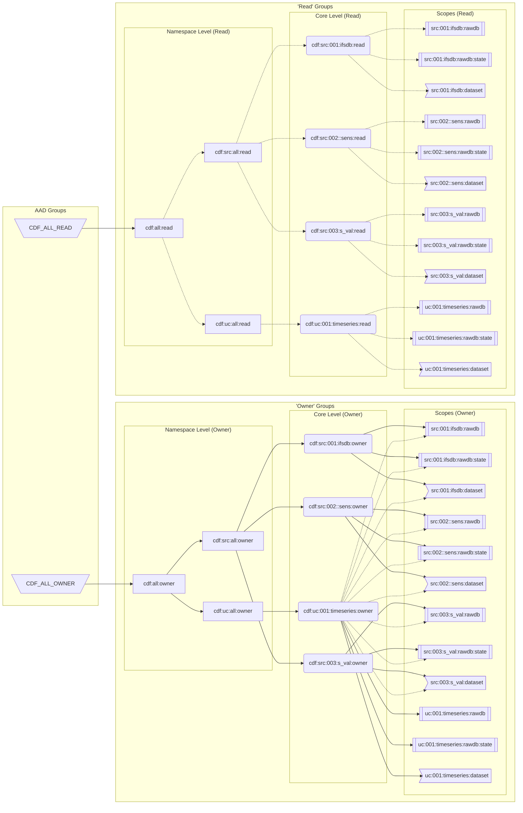

# InSo Bootstrap CLI

## Scope of Work

Disclaimer:
> The repository name is prefixed with `inso-`, marking this solution as provided by Cognite Industry Solution (InSo) team, but is not an offical supported CLI / GitHub Action from Cognite with product-grade SLOs.

Purpose:

- Providing a configuration driven bootstrap of CDF Groups, Datasets, RAW Databases with data-separation on sources, use-case and user-input level.
- Aiming for **DAY1**:
  - the initial-setup phase: your first configuration of a new CDF Project
- Support for **DAY2**:
  - the operational phase: running maintenance and change-management against your scaled (multiple) CDF Projects


## Table of Content
<!-- @import "[TOC]" {cmd="toc" depthFrom=1 depthTo=6 orderedList=false} -->

<!-- code_chunk_output -->

- [InSo Bootstrap CLI](#inso-bootstrap-cli)
  - [Scope of Work](#scope-of-work)
  - [Table of Content](#table-of-content)
  - [Bootstrap CLI concept](#bootstrap-cli-concept)
  - [Bootstrap CLI commands](#bootstrap-cli-commands)
    - [`Prepare` command](#prepare-command)
    - [`Deploy` command](#deploy-command)
    - [`Delete` command](#delete-command)
  - [Configuration](#configuration)
    - [Configuration for all commands](#configuration-for-all-commands)
      - [Configuration for `deploy` command](#configuration-for-deploy-command)
      - [`aad_mappings` section: AAD Group to CDF Group mapping](#aad_mappings-section-aad-group-to-cdf-group-mapping)
        - [`bootstrap` section](#bootstrap-section)
      - [Configuration for `delete` command](#configuration-for-delete-command)
        - [`delete_or_deprecate` section](#delete_or_deprecate-section)
- [Development / Contribute](#development--contribute)
  - [semantic versioning](#semantic-versioning)
  - [to be done](#to-be-done)
- [how to run](#how-to-run)
  - [run local with poetry](#run-local-with-poetry)
  - [run local with Python](#run-local-with-python)
  - [run local with Docker](#run-local-with-docker)
  - [run as github action](#run-as-github-action)

<!-- /code_chunk_output -->
## Bootstrap CLI concept

The Bootstrap CLI aims to tackle both DAY1 and DAY2 activities releated to Access Management. This include:
- Groups
- Scopes
  - Data Sets
  - Raw DBs


DAY1 activities are initial setup and configurations before a system can be used.
Followed by DAY2 activities which are the operational use of the system and scaling.

Cognite provides support for a list of DAY1 activities, to enable governance best-practices from the start, such as:

* **Secure access management** to control access for users, apps and services to the various types of resources (data sets, assets, files, events, time series, etc.) in CDF
* **Data Sets** to document and track data lineage
* **Data quality** like monitoring the data integration pipelines into CDF

As all of this is connected to each other, and it is spanning customers Identity Provider (Azure AD) and CDF, this tool utilizes the CDF API for a configuration driven approach for the CDF part.

### **Secure access management**

**Secure access management** requires connection of Azure AD (AAD) Groups to CDF Groups. User or app Authentication is provided by customers AAD and Authorization by CDF Groups. CDF Groups are defined through capabilities and actions (like "Timeseries" capability with "Read/Write" actions).

**Secure access management** related configuration targets:
* CDF Groups and links to AAD Groups
* AAD-owner responsibilities:
  * AAD Group creation
  * Service-principal (user and apps) creation and mapping to AAD Groups

### **Data Sets**

CDF **Data Sets** are used to scope CDF Groups capabilties to a set of CDF Resources. This allows fencing future usage, to stay within this scope. Creation of new Data Sets is a governace related action, and is executed by a defined process. An exception is CDF RAW data which is scoped through CDF RAW Databases.

CDF **Scopes** related configuration targets:
* CDF Data Sets
* CDF RAW Databases

### **Bootstrap CLI simplifications**

The inso bootstrap cli offers a simplified way of controlling these elements. With a single two layered hierarchy it handles the creation of CDF groups, scopes (datasets/raw DBs) and their connection to AAD groups. The first layer of the hierarchy is a namespace and the second one is individual elements within a namespace. An example of this could be having the following namespaces with explanation for why this could be a good idea:
* **src**: to scope 3rd party sources
* **fac**: to scope customer facilities by name
* **ca**: to scope "corporate applications" (SAP, Salesforce, ..)
* **uc**: to scope your use-cases ("UC:001 - Flow Optimization", "UC:002 - Trading Balances"
* **in**: to scope user-input from UIs

This is just an example of how to group things, you are free to chose whatever grouping you like. Good style is to keep the namespaces and the namespace elements short.

### **Bootstrap CLI example**
An example config with the main abilities of the CLI. Shared owner access is also possible, but omitted here for simplicity.
```yaml
bootstrap:
  src:
    src:001:ifsdb:
      description: Data from IFSDB
      external_id: src:001:ifsdb
    src:002:sens:
      description: Information on sensors
      external_id: src:002:sen
    src:003:s_val:
      description: Sensor values
      external_id: src:003:s_val

  uc:
    uc:001:timeseries:
      description: Contextualised sensorvalues
      external_id: uc:001:timeseries
      metadata:
        created: 220328
        generated: by CDF Bootstrap script
      shared_read_access:
        - src:001:ifsdb
        - src:002:sens
        - src:003:s_val
```

Using the diagram functionalty of the CLI we can produce the following chart of the example config.



As one can see, even for this simple use case, the cli creates quite a lot of resources. There reason for this is to both provide the outward simplicity of a DAY1 setup like it is shown here, but with the possibility to add more granular group control later on. In this DAY1 setup, only the two top groups are mapped to actual AAD-groups.

If we take a closer look at only one namespace element.
```
src:001:ifsdb
```
For this element the cli creates/updates the following resources:
#### **Groups**
```
cdf:all:owner
cdf:all:read

cdf:src:all:owner
cdf:src:all:read

cdf:src:001:ifsdb:owner
cdf:src:001:ifsdb:read
```
#### **Scopes**
```
all:dataset
all:rawdb
all:rawdb:state

src:all:dataset
src:all:rawdb
src:all:rawdb:state

src:001:ifsdb:dataset
src:001:ifsdb:rawdb
src:001:ifsdb:rawdb:state
```
This allows us to give access to for example all sources or just to a specific one like src:001 while forcing data to always be written into datasets.


## Bootstrap CLI commands

Common parameters for all commands, which most are typically provided through environment variables (prefixed with `BOOTSTRAP_`):

```text
Usage: bootstrap-cli [OPTIONS] COMMAND [ARGS]...

Options:
  --version                Show the version and exit.
  --cdf-project-name TEXT  Project to interact with transformations API,
                           'BOOTSTRAP_CDF_PROJECT',environment variable can be
                           used instead. Required for OAuth2 and optional for
                           api-keys.
  --cluster TEXT           The CDF cluster where Transformations is hosted
                           (e.g. greenfield, europe-west1-1),Provide this or
                           make sure to set 'BOOTSTRAP_CDF_CLUSTER'
                           environment variable.
  --host TEXT              The CDF cluster where Bootstrap-Pipelines are
                           hosted (e.g.
                           https://bluefield.cognitedata.com),Provide this or
                           make sure to set 'BOOTSTRAP_CDF_HOST' environment
                           variable.
  --api-key TEXT           API key to interact with transformations API.
                           Provide this or make sure to set
                           'BOOTSTRAP_CDF_API_KEY',environment variable if you
                           want to authenticate with API keys.
  --client-id TEXT         Client ID to interact with transformations API.
                           Provide this or make sure to
                           set,'BOOTSTRAP_IDP_CLIENT_ID' environment variable
                           if you want to authenticate with OAuth2.
  --client-secret TEXT     Client secret to interact with transformations API.
                           Provide this or make sure to
                           set,'BOOTSTRAP_IDP_CLIENT_SECRET' environment
                           variable if you want to authenticate with OAuth2.
  --token-url TEXT         Token URL to interact with transformations API.
                           Provide this or make sure to
                           set,'BOOTSTRAP_IDP_TOKEN_URL' environment variable
                           if you want to authenticate with OAuth2.
  --scopes TEXT            Scopes to interact with transformations API,
                           relevant for OAuth2 authentication
                           method,'BOOTSTRAP_IDP_SCOPES' environment variable
                           can be used instead.
  --audience TEXT          Audience to interact with transformations API,
                           relevant for OAuth2 authentication
                           method,'BOOTSTRAP_IDP_AUDIENCE' environment
                           variable can be used instead.
  --dotenv-path TEXT       Provide a relative or absolute path to an .env file
                           (for commandline usage only)
  --dry-run [yes|no]       Output planned action while doing nothing
  -h, --help               Show this message and exit.

Commands:
  delete   Delete mode used to delete CDF Groups, Datasets and Raw...
  deploy   Deploy a set of bootstrap from a config-file
  diagram  Diagram mode used to document the given configuration as a...
  prepare  Prepare an elevated CDF Group 'cdf:bootstrap', using the same...
```
### `Prepare` command

The first time you plan to run `bootstrap-cli` for your new CDF project, the `prepare` is required to create a CDF Group with capabilities which allows it to run the other commands.

A new CDF Project is typically only configured with one CDF Group (named `oidc-admin-group`) which grants these capabilities:
  - `projects:[read,list,update]`
  - `groups:[create,delete,update,list,read]`

To run bootstrap-cli additional capabilities (and actions) are required:

- `datasets:[read,write,owner]`
- `raw:[read,write,list]`

The `prepare` command creates a new CDF Group named `cdf:bootstrap` with this capabilities.
The command requires an AAD Group ID to link to, which typically for a new project is the one configured
for the CDF Group named `oidc-admin-group`. How to aquire it:

1. Login to Fusion
2. Navigate to Manage Access
3. filter for `oidc-admin-group`
4. Edit and copy the value from "Source ID"
5. provide it as `--aad-source-id=<source-id>` parameter to the `prepare` command and your configuration file

```text
Usage: bootstrap-cli prepare [OPTIONS] [CONFIG_FILE]

  Prepare an elevated CDF Group 'cdf:bootstrap', using the same AAD Group link
  as your initially provided 'oidc-admin-group'. With additional capabilities
  to to run the 'deploy' and 'delete' commands next. The 'prepare' command is
  only required once per CDF Project.

Options:
  --debug               Print debug information
  --aad-source-id TEXT  Provide the AAD Source ID to use for the
                        'cdf:bootstrap' Group. Typically for a new project its
                        the one configured for the CDF Group named 'oidc-
                        admin-group'.  [required]
  -h, --help            Show this message and exit.
```

### `Deploy` command

The bootstrap-cli `deploy` command will apply the configuration-file to your CDF Project.
It will create the necessary CDF Groups, Datasets and RAW Databases.
This command supports GitHub-Action workflow too. To check what this command is going to do, run it with the flag `--dry-run=yes`.

```text
Usage: bootstrap-cli deploy [OPTIONS] [CONFIG_FILE]

  Deploy a set of bootstrap from a config-file

Options:
  --debug                         Print debug information
  --with-special-groups [yes|no]  Create special CDF Groups, which don't have
                                  capabilities (extractions, transformations)
  -h, --help                      Show this message and exit.
```

### `Delete` command

If it is necessary to revert any changes, the `delete` mode can be used to delete CDF Groups, Datasets and RAW Databases.
Note that the CDF Groups and RAW Databases will be deleted, while Datasets will be archived and deprecated, not deleted. To check what this command is going to do, run it with the flag `--dry-run=yes`.

```text
Usage: bootstrap-cli delete [OPTIONS] [CONFIG_FILE]

  Delete mode used to delete CDF Groups, Datasets and Raw Databases,CDF Groups
  and RAW Databases will be deleted, while Datasets will be archived and
  deprecated, not deleted

Options:
  --debug     Print debug information
  -h, --help  Show this message and exit.
```
### `Diagram` command

The diagram command is used to create a mermaid diagram to visualize the end state of a given configuration. This can be used to check the config file and to see if the constructed hiarchy is optimal. It is also very practical for documentation purposes.
```
Usage: bootstrap-cli diagram [OPTIONS] [CONFIG_FILE]

  Diagram mode used to document the given configuration as a Mermaid diagram

Options:
  --markdown [yes|no]  Encapsulate Mermaid diagram in Markdown syntax
  -h, --help           Show this message and exit.
```
## Configuration

A YAML configuration file must be passed as an argument when running the program.
Different configuration file used for delete and prepare/deploy

### Configuration for all commands

All commands share a `cognite` and a `logger` section in the YAML manifest, which is common to our Cognite Database-Extractor configuration.

The configuration file supports variable-expansion (`${BOOTSTRAP_**}`), which are provided either as
1. environment-variables,
2. through an `.env` file or
3. command-line parameters

Here is an example:

```yaml
# follows the same parameter structure as the DB extractor configuration
cognite:
  host: ${BOOTSTRAP_CDF_HOST}
  project: ${BOOTSTRAP_CDF_PROJECT}
  #
  # AAD IdP login:
  #
  idp-authentication:
    client-id: ${BOOTSTRAP_IDP_CLIENT_ID}
    secret: ${BOOTSTRAP_IDP_CLIENT_SECRET}
    scopes:
      - ${BOOTSTRAP_IDP_SCOPES}
    token_url: ${BOOTSTRAP_IDP_TOKEN_URL}

logger:
  file:
    path: ./logs/test-deploy.log
    level: INFO
  console:
    level: INFO
```

#### Configuration for `deploy` command

In addition to the sections described above, the configuration file for `deploy` command requires two more sections:

- `bootstrap` - declaration of the logical access-control group structure
- `aad_mappings` - mapping AAD Group object-ids with CDF Groups

#### `aad_mappings` section: AAD Group to CDF Group mapping

Used to link CDF Groups with AAD Groups.
Defines the name of the CDF Group, with the AAD Group object-id, and for documentation the AAD Group name.

Example:

```yaml
aad_mappings:
  #cdf-group-name:
  #  - aad-group-object-id
  #  - READABLE_NAME like the AAD Group name
  cdf:all:owner:
    - 123456-7890-abcd-1234-314159
    - CDF_DEV_ALL_OWNER
```

##### `bootstrap` section

The `bootstrap` section allows a two-level configuration of access-control groups:

Like for example:

- `src` for sources or `ca` for corporate applications,
- `in` for user-input control,
- `uc` typically for use-cases (providing the data-product and built on top of the other data-sources)

A minimal configuration file of the `bootstrap` section:

```yaml
bootstrap:
  src:
    src:001:name:
      description: Description about sources related to name
      external_id: src:001:name
  in:
    in:001:name:
      description: Description about user inputs related to name
      external_id: in:001:name
  uc:
    uc:001:name:
      description: Description about use case
      external_id: uc:001:name
      metadata:
        created: 210325
        generated: by cdf-config-hub script
      shared_read_access:
        - src:001:name
      shared_owner_access:
        - in:001:name
```

For a complete example of the `deploy` configuration, see `configs/test-bootstrap-deploy-example.yml`.

#### Configuration for `delete` command

In addition to the `config` and `logger` sections described above, the configuration file for delete mode
should include one more section:

* `delete_or_deprecate` - used to define which CDF Datasets, CDF Groups and RAW databases (including tables) should to be deleted (CDF Datasets are in-fact only deprecated, as they cannot be deleted)

##### `delete_or_deprecate` section

This section defines what `datasets` that should be deprecated, and which `groups` and `raw_dbs` that should be deleted.

Example configuration:

```yml
delete_or_deprecate:
  # datasets: []
  datasets:
    - test:fac:001:name
  # groups: []
  groups:
    - test:fac:001:name:owner
    - test:fac:001:name:read
  # raw_dbs: []
  raw_dbs:
    - test:fac:001:name:rawdb
```

If nothing to delete, provide an empty list like this: `[]`.

**Tip:** After running the bootstrap in `deploy` mode, the final part of the output logs will include a "Delete template" section. This can be used for copy-paste the item names to the `delete` configuration.

For a complete example of the delete configuration, see the `configs/test-bootstrap-delete-example.yml`.

# Development / Contribute

1. Clone the repository and `cd` to the project folder.  Then,
2. initialize the project environment:

    ```sh
    poetry install
    ```

3. Install the pre-commit hook:

    ```sh
    poetry run pre-commit install #Only needed if not installed
    poetry run pre-commit run --all-files
    ```
## semantic versioning
- Uses `semantic-release` to create version tags.
- The rules for commit messages are conventional commits, see [conventionalcommits](https://www.conventionalcommits.org/en/v1.0.0-beta.4/#summary%3E)
- Remark: If version needs change, before merge, make sure commit title has elements mentioned on `conventionalcommits`
- Remark: with new version change, bump will update the version on `pyproject.toml` so no need to change version there.
- Remark: version in `incubator/bootstrap_cli/__init__` is used in main to add version on metadata.
  This is not a part of semantic release but needs to be updated to upcoming version before version update.
## to be done

- [x] `.pre-commit-config.yaml` hook support
- [x] `.dockerignore` (pycache)
- [x] logs folder handling (docker volume mount)
- [x] logger.info() or print() or click.echo(click.style(..))
    - logger debug support
- [ ] compile as EXE (when Python is not available on customer server)
  - code-signed exe required for Windows

# how to run
- it provides a configuration driven deployment for Cognite Bootstrap Pipelines (named `bootstrap` in short)
  - support to run it
    - from `poetry run`
    - from `python -m`
    - from `docker run`
    - and as GitHub Action

- templates used for implementation are
  - `cognitedata/transformation-cli`
  - `cognitedata/python-extratcion-utils`
    - using `CogniteConfig` and `LoggingConfig`
    - and extended with custom config sections

Follow the initial setup first
1. Fill out relevant configurations from `configs`
  - Fill out `aad_mappings` and `bootstrap` from `test-bootstrap-deploy-example.yml`
  - Fill out `delete_or_deprecate` from `test-bootstrap-delete-example.yml`
2. For local testing, copy `.env_example` to `.env`
   - complete CDF and IdP configuration in `.env`
## run local with poetry

```bash
  poetry build
  poetry install
  poetry update
```
- Deploy mode:
```bash
  poetry run bootstrap-cli deploy --debug configs/test-bootstrap-deploy-example.yml
```
- Prepare mode:
```bash
  poetry run bootstrap-cli prepare --debug configs/test-bootstrap-deploy-example.yml
```
- Delete mode:
```bash
  poetry run bootstrap-cli delete --debug configs/test-bootstrap-delete-example.yml
```

## run local with Python

```bash
export PYTHONPATH=.

python incubator/bootstrap_cli/__main__.py deploy configs/ test-bootstrap-deploy-example.yml
```

## run local with Docker
- `.dockerignore` file
- volumes for `configs` (to read) and `logs` folder (to write)

```bash
docker build -t incubator/bootstrap-cli:v1.0 -t incubator/bootstrap-cli:latest .

# ${PWD} because only absolute paths can be mounted
docker run --volume ${PWD}/configs:/configs --volume ${PWD}/logs:/logs  --env-file=.env incubator/bootstrap-cli deploy /configs/test-bootstrap-deploy-example.yml
```

Debug the Docker container
- requires override of `ENTRYPOINT`
- to get full functional `bash` a `Dockerfile.debug` is provided

```bash
➟  docker build -t incubator/bootstrap-cli:debug -f Dockerfile.debug .

➟  docker run --volume ${PWD}/configs:/configs --volume ${PWD}/logs:/logs  --env-file=.env -it --entrypoint /bin/bash incubator/bootstrap-cli:debug
```

## run as github action

```yaml
jobs:
  deploy:
    name: Deploy Bootstrap Pipelines
    environment: dev
    runs-on: ubuntu-latest
    # environment variables
    env:
      CDF_PROJECT: yourcdfproject
      CDF_CLUSTER: bluefield
      IDP_TENANT: abcde-12345
      CDF_HOST: https://bluefield.cognitedata.com/
      # use a tagged release like @v1.2.1
      # - uses: cognitedata/inso-bootstrap-cli@v1.2.1
      # or use the latest release available using @main
      - uses: cognitedata/inso-bootstrap-cli@main
        env:
            BOOTSTRAP_IDP_CLIENT_ID: ${{ secrets.CLIENT_ID }}
            BOOTSTRAP_IDP_CLIENT_SECRET: ${{ secrets.CLIENT_SECRET }}
            BOOTSTRAP_CDF_HOST: ${{ env.CDF_HOST }}
            BOOTSTRAP_CDF_PROJECT: ${{ env.CDF_PROJECT }}
            BOOTSTRAP_IDP_TOKEN_URL: https://login.microsoftonline.com/${{ env.IDP_TENANT }}/oauth2/v2.0/token
            BOOTSTRAP_IDP_SCOPES: ${{ env.CDF_HOST }}.default
        # additional parameters for running the action
        with:
          config_file: ./configs/test-bootstrap-deploy-example.yml
          # "yes"|"no" deploy with special groups and aad_mappings
          with_special_groups: "yes"
```
